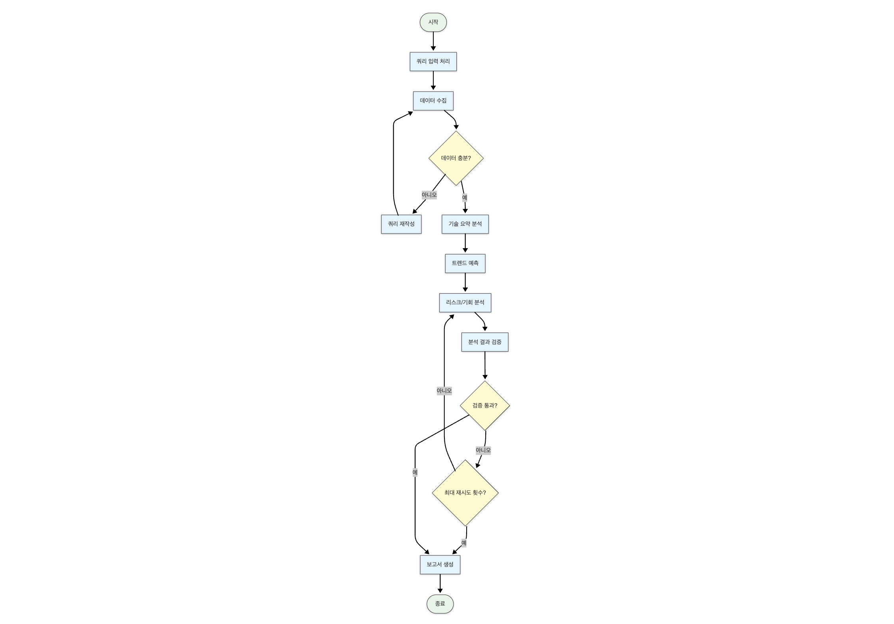

# TITLE
본 프로젝트는 미래 기술 트렌드 분석 에이전트를 설계하고 구현한 실습 프로젝트입니다.

## Overview

- Objective : 급변하는 기술 사회에서 기업에서 관심있게 봐야할 AI Robotics 기술 트렌드 예측
- Methods : 뉴스/논문 기반 수집 및 요약, 정량 지표 기반 트렌트 예측, LangGraph 기반 AI 에이전트
- Tools : 

## Features
- 01. 뉴스, 연구, 정책 데이터의 자동 수집 및 정량 지표 추출
- 02. 논문 수, 검색량, 투자 금액 등 객관적 지표 기반 트렌드 분석
- 03. 단계적 에이전트 협업을 통한 종합 미래 기술 보고서 생성


## Tech Stack 

| Category   | Details                      |
|------------|------------------------------|
| Framework  | LangGraph, LangChain, Python |
| LLM        | GPT-4o-mini via OpenAI API   |
| Retrieval  | Tavily, Google Trends API, Data.gov API |


## Agents

- news_agent: 기술 키워드 기반으로 뉴스 크롤링 및 기업 IR 정보 수집 및 분석
- research_agent: 논문 제목/초록 수집, 연도별 논문 수 수집 및 요약
- policy_agent: 정부 기술 정책 PDF 정리 및 키워드 요약
- tech_summary_gent: 상위 뉴스/논문/정책에서 공통 기술 키워드 및 문맥 추출
- trend_predict_agent: 뉴스 기사 수, Google Trends 지표, 투자 금액 등 정량 지표를 바탕으로 기술 트렌드 스코어 예측
- risk_opportunity_agent: 주요 기술 및 시장 동향과 관련된 리스크와 기회 요인 분석
- report_agnet: 상위 결과들을 요약하여 PDF 형식 보고서 생성

## State 

기본 정보
- initial_query: 사용자가 처음 입력한 원본 쿼리를 저장합니다.
- current_keywords: 데이터 수집 및 분석에 현재 사용 중인 키워드 목록입니다.

데이터 수집 결과
- research_data_output: 연구 데이터 수집 결과를 저장하는 딕셔너리입니다.
- tech_news_output: 기술 뉴스 수집 결과를 저장하는 딕셔너리입니다.
- company_ir_output: 기업 IR(투자자 관계) 자료 수집 결과를 저장하는 딕셔너리입니다.
- policy_data_output: 정책 관련 데이터 수집 결과를 저장하는 딕셔너리입니다.

분석 결과
- tech_summary_analysis: 핵심 기술 요약 분석 결과를 저장하는 딕셔너리입니다.
- trend_prediction_analysis: 기술 트렌드 예측 분석 결과를 저장하는 딕셔너리입니다.
- risk_opportunity_analysis: 리스크 및 기회 요인 분석 결과를 저장하는 딕셔너리입니다.

처리 제어 변수
- data_collection_iteration_count: 현재까지 수행된 데이터 수집 반복 횟수입니다.
- max_data_collection_iterations: 최대 허용 데이터 수집 반복 횟수입니다. (2회로 설정)
- validation_attempt_count: 현재까지 수행된 검증 시도 횟수입니다.
- max_validation_attempts: 최대 허용 검증 시도 횟수입니다. (2회로 설정)
- last_validation_issues: 마지막 검증에서 발견된 문제점 목록입니다.
- is_current_analysis_valid: 현재 분석 결과의 유효성을 나타내는 불리언 값입니다.

로그 및 최종 결과
- process_log: 전체 분석 과정의 로그 메시지를 저장하는 리스트입니다.
- final_report_content: 최종 생성된 보고서 내용을 저장하는 문자열입니다.

  

- paper_count_by_year: 연도별 해당 기술 분야의 논문 수 통계로 기술 성숙도 및 관심도 추이 정량적 파악
- google_trends_score: Google Trends에서 수집된 키워드별 검색 관심도
- investment_data: Crunchbase 또는 관련 API에서 수집한 분야별 스타트업 투자 금액 또는 건수.

- trend_score: 트렌드 예측 Agent가 생성한 미래 기술 성장성 예측 점수
- risk_factors: 리스크 및 기회 분석 Agent가 추출한 리스크 요인
- opportunity_factors: 리스크 및 기회 분석 Agent가 도출한 기회 요인

- final_report: 트렌드 보고서 작성 Agent가 생성한 종합 미래 기술 트렌드 보고서

## Architecture


## Directory Structure
```
├── data/                          # 수집된 PDF 및 JSON 문서
├── agents/ 
│   ├── news_agent.py              # 뉴스 수집
│   ├── research_agent.py          # 연구 수집
│   ├── policy_agent.py            # 정책 조사
│   ├── tech_summary_agent.py      # 핵심기술 요약
│   ├── trend_predict_agent.py     # 트렌트 예측
│   ├── risk_opportunity_agent.py  # 리스크 및 기회 분석
│   ├── validation_agent.py        # 결과 검토 단계
│   └── report_agent.py            # 트렌드 보고서 작성  
├── prompts/                       # 프롬프트 템플릿
├── outputs/                       # 보고서 및 중간 결과 저장
├── utils/                         # 보고서 및 중간 결과 저장
│   └── data_utils.py              # 부가 기능 구현 
├── config.py                      # 환경 설정
├── main.py                        # 실행 스크립트
└── README.md
```

## Contributer
- 여다건 : Prompt Engineering, Agent Design
   - 느낀점: 
   Agent 역할에 대해서 설계를 시작하고 진행하였음에도 구현시 계획에 맞게 진행하지 않아 AgentState가 명확하지 않는 마무리를 하게 되었습니다.
   "Data 수집 -> 요약 -> 트렌드 예측 -> 위험 및 기회요소 평가 -> 보고서 생성" 단계로 계획하였으나, 세부 Agent 에서 역할이 혼재됨과 수집된 자료의 전달로 인해 검증 단계를 추가했음에도 불구하고 신뢰성을 보장한 최종 보고서 생성이 어려웠습니다. 
   이후에는 각 Agent 역할과 State를 명확히 하고, 이를 구현에 반영하고자 합니다.
